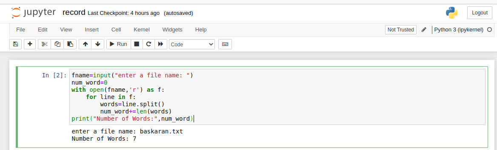

# Word-count
## AIM:
To write a python program for getting the word count from a text.
## EQUIPEMENT'S REQUIRED: 
PC
Anaconda - Python 3.7
## ALGORITHM: 
### Step 1:
open jypter notebook
### Step 2: 
 creat new file
### Step 3: 
start programming
### Step 4:  
write code add text file in same address
### Step 5: 
open a file in read mode and use split() and it and print the output
### Step 6: 
end program
## PROGRAM:
```
fname=input("enter a file name: ")
num_word=0
with open(fname,'r') as f:
    for line in f:
        words=line.split()
        num_word+=len(words)
print("Number of Words:",num_word)
```
### OUTPUT:

## RESULT:
Thus the program is written to find the word count from a text.
